# service_worker_type_classic_build

<sub>
  Generated by <a href="https://github.com/jsenv/core/tree/main/packages/independent/snapshot">@jsenv/snapshot</a> executing <a href="../service_worker_type_classic_build.test.mjs">../service_worker_type_classic_build.test.mjs</a>
</sub>

## 0_basic

```js
build({
  ...testParams,
})
```

### 1/4 logs



<details>
  <summary>see without style</summary>

```console

build "./main.html"
⠋ generate source graph
✔ generate source graph (done in <X> second)
⠋ bundle "css"
✔ bundle "css" (done in <X> second)
⠋ generate build graph
✔ generate build graph (done in <X> second)
⠋ inject urls in service worker
✔ inject urls in service worker (done in <X> second)
⠋ write files in build directory

```

</details>


### 2/4 write 5 files into "./build/"

see [./service_worker_type_classic_build/0_basic/build/](./service_worker_type_classic_build/0_basic/build/)

### 3/4 logs


<details>
  <summary>see without style</summary>

```console
✔ write files in build directory (done in <X> second)
--- build files ---  
- html : 1 (18.7 kB / 93.9 %)
- css  : 1 (24 B / 0.1 %)
- js   : 3 (1.2 kB / 6 %)
- total: 5 (19.9 kB / 100 %)
--------------------
```

</details>


### 4/4 resolve

```js
{}
```