# service_worker_type_module_build

<sub>
  Generated by <a href="https://github.com/jsenv/core/tree/main/packages/independent/snapshot">@jsenv/snapshot</a> executing <a href="../service_worker_type_module_build.test.mjs">../service_worker_type_module_build.test.mjs</a>
</sub>

## 0_sw_type_module

```js
build({
  ...testParams,
  runtimeCompat: { chrome: "80" },
  versioning: false, // to prevent importmap forcing fallback on js classic
})
```

### 1/4 logs


<details>
  <summary>see without style</summary>

```console

build "./main.html"
⠋ generate source graph
✔ generate source graph (done in <X> second)
⠋ bundle "css"
✔ bundle "css" (done in <X> second)
⠋ bundle "js_module"
✔ bundle "js_module" (done in <X> second)
⠋ generate build graph
✔ generate build graph (done in <X> second)
⠋ inject urls in service worker
✔ inject urls in service worker (done in <X> second)
⠋ write files in build directory

```

</details>


### 2/4 write 3 files into "./build/"

see [./service_worker_type_module_build/0_sw_type_module/build/](./service_worker_type_module_build/0_sw_type_module/build/)

### 3/4 logs


<details>
  <summary>see without style</summary>

```console
✔ write files in build directory (done in <X> second)
--- build files ---  
- html : 1 (1.7 kB / 78 %)
- css  : 1 (24 B / 1 %)
- js   : 1 (467 B / 21 %)
- total: 3 (2.2 kB / 100 %)
--------------------
```

</details>


### 4/4 resolve

```js
{}
```

## 1_sw_type_module_no_bundling

```js
build({
  ...testParams,
  runtimeCompat: { chrome: "80" },
  versioning: false, // to prevent importmap forcing fallback on js classic
  bundling: false,
})
```

### 1/4 logs


<details>
  <summary>see without style</summary>

```console

build "./main.html"
⠋ generate source graph
✔ generate source graph (done in <X> second)
⠋ generate build graph
✔ generate build graph (done in <X> second)
⠋ inject urls in service worker
✔ inject urls in service worker (done in <X> second)
⠋ write files in build directory

```

</details>


### 2/4 write 5 files into "./build/"

see [./service_worker_type_module_build/1_sw_type_module_no_bundling/build/](./service_worker_type_module_build/1_sw_type_module_no_bundling/build/)

### 3/4 logs


<details>
  <summary>see without style</summary>

```console
✔ write files in build directory (done in <X> second)
--- build files ---  
- html : 1 (1.7 kB / 73 %)
- css  : 1 (24 B / 1 %)
- js   : 3 (597 B / 26 %)
- total: 5 (2.3 kB / 100 %)
--------------------
```

</details>


### 4/4 resolve

```js
{}
```

## 2_sw_type_module_fallback

```js
build({
  ...testParams,
  runtimeCompat: { chrome: "79" },
})
```

### 1/4 logs



<details>
  <summary>see without style</summary>

```console

build "./main.html"
⠋ generate source graph
✔ generate source graph (done in <X> second)
⠋ bundle "css"
✔ bundle "css" (done in <X> second)
⠋ bundle "js_module"
✔ bundle "js_module" (done in <X> second)
⠋ generate build graph
✔ generate build graph (done in <X> second)
⠋ inject urls in service worker
✔ inject urls in service worker (done in <X> second)
⠋ write files in build directory

```

</details>


### 2/4 write 3 files into "./build/"

see [./service_worker_type_module_build/2_sw_type_module_fallback/build/](./service_worker_type_module_build/2_sw_type_module_fallback/build/)

### 3/4 logs


<details>
  <summary>see without style</summary>

```console
✔ write files in build directory (done in <X> second)
--- build files ---  
- html : 1 (19 kB / 92.5 %)
- css  : 1 (24 B / 0.1 %)
- js   : 1 (1.5 kB / 7.4 %)
- total: 3 (20.6 kB / 100 %)
--------------------
```

</details>


### 4/4 resolve

```js
{}
```

## 3_sw_type_module_fallback_no_bundling

```js
build({
  ...testParams,
  runtimeCompat: { chrome: "79" },
  bundling: false,
})
```

### 1/4 logs


<details>
  <summary>see without style</summary>

```console

build "./main.html"
⠋ generate source graph
✔ generate source graph (done in <X> second)
⠋ generate build graph
✔ generate build graph (done in <X> second)
⠋ inject urls in service worker
✔ inject urls in service worker (done in <X> second)
⠋ write files in build directory

```

</details>


### 2/4 write 5 files into "./build/"

see [./service_worker_type_module_build/3_sw_type_module_fallback_no_bundling/build/](./service_worker_type_module_build/3_sw_type_module_fallback_no_bundling/build/)

### 3/4 logs


<details>
  <summary>see without style</summary>

```console
✔ write files in build directory (done in <X> second)
--- build files ---  
- html : 1 (19.4 kB / 54.65 %)
- css  : 1 (24 B / 0.068 %)
- js   : 3 (16 kB / 45.28 %)
- total: 5 (35.4 kB / 100 %)
--------------------
```

</details>


### 4/4 resolve

```js
{}
```