# worker_babel_helpers_shared_build

<sub>
  Generated by <a href="https://github.com/jsenv/core/tree/main/packages/independent/snapshot">@jsenv/snapshot</a> executing <a href="../worker_babel_helpers_shared_build.test.mjs">../worker_babel_helpers_shared_build.test.mjs</a>
</sub>

## 0_basic

```js
build({
  ...testParams,
})
```

### 1/4 logs


<details>
  <summary>see without style</summary>

```console

build "./main.html"
⠋ generate source graph
✔ generate source graph (done in <X> second)
⠋ bundle "js_module"
✔ bundle "js_module" (done in <X> second)
⠋ generate build graph
✔ generate build graph (done in <X> second)
⠋ write files in build directory

```

</details>


### 2/4 write 4 files into "./build/"

see [./worker_babel_helpers_shared_build/0_basic/build/](./worker_babel_helpers_shared_build/0_basic/build/)

### 3/4 logs



<details>
  <summary>see without style</summary>

```console
✔ write files in build directory (done in <X> second)
--- build files ---  
- html : 1 (17 kB / 47 %)
- js   : 3 (19 kB / 53 %)
- total: 4 (36 kB / 100 %)
--------------------
```

</details>


### 4/4 resolve

```js
{}
```