# worker_versioning_importmap_build

<sub>
  Generated by <a href="https://github.com/jsenv/core/tree/main/packages/independent/snapshot">@jsenv/snapshot</a> executing <a href="../worker_versioning_importmap_build.test.mjs">../worker_versioning_importmap_build.test.mjs</a>
</sub>

## 0_importmap

```js
build({
  ...testParams,
  runtimeCompat: { chrome: "89" },
})
```

### 1/4 logs


<details>
  <summary>see without style</summary>

```console

build "./main.html"
⠋ generate source graph
✔ generate source graph (done in <X> second)
⠋ generate build graph
✔ generate build graph (done in <X> second)
⠋ write files in build directory

```

</details>


### 2/4 write 4 files into "./build/"

see [./worker_versioning_importmap_build/0_importmap/build/](./worker_versioning_importmap_build/0_importmap/build/)

### 3/4 logs



<details>
  <summary>see without style</summary>

```console
✔ write files in build directory (done in <X> second)
--- build files ---  
- html : 1 (467 B / 42 %)
- js   : 3 (644 B / 58 %)
- total: 4 (1.1 kB / 100 %)
--------------------
```

</details>


### 4/4 resolve

```js
{}
```

## 1_importmap_fallback

```js
build({
  ...testParams,
  runtimeCompat: { chrome: "88" },
})
```

### 1/4 logs


<details>
  <summary>see without style</summary>

```console

build "./main.html"
⠋ generate source graph
✔ generate source graph (done in <X> second)
⠋ generate build graph
✔ generate build graph (done in <X> second)
⠋ write files in build directory

```

</details>


### 2/4 write 4 files into "./build/"

see [./worker_versioning_importmap_build/1_importmap_fallback/build/](./worker_versioning_importmap_build/1_importmap_fallback/build/)

### 3/4 logs



<details>
  <summary>see without style</summary>

```console
✔ write files in build directory (done in <X> second)
--- build files ---  
- html : 1 (17.8 kB / 52 %)
- js   : 3 (16.5 kB / 48 %)
- total: 4 (34.3 kB / 100 %)
--------------------
```

</details>


### 4/4 resolve

```js
{}
```