# [0_basic](../../workspace_bundle.test.mjs)

```js
run()
```

# 1/3 logs



<details>
  <summary>see without style</summary>

```console
GET http://127.0.0.1/main.html
internal error while handling request
--- error stack ---
TypeError: Cannot set property packageDirectoryUrl of #<Object> which has only a getter
    at urlInfoCreated (@jsenv/core/src/plugins/workspace_bundle/jsenv_plugin_workspace_bundle.js:13:35)
    at callHook (@jsenv/core/src/plugins/plugin_controller.js:187:25)
    at Object.callHooks (@jsenv/core/src/plugins/plugin_controller.js:229:27)
    at @jsenv/core/src/kitchen/kitchen.js:151:22
    at Object.emit (@jsenv/core/src/helpers/event_emitter.js:14:7)
    at Object.reuseOrCreateUrlInfo (@jsenv/core/src/kitchen/url_graph/url_graph.js:56:34)
    at Object.createResolveAndFinalize (@jsenv/core/src/kitchen/url_graph/references.js:46:35)
    at Object.fetch (@jsenv/core/src/dev/start_dev_server.js:467:52)
    at Object.match (@jsenv/core/packages/backend/server/src/router/router.js:411:36)
    at @jsenv/core/packages/backend/server/src/start_server.js:572:55
  500 Internal Server Error
chromium console.error > Failed to load resource: the server responded with a status of 500 (Internal Server Error)
```

</details>


# 2/3 write file "./client/packages/foo/answer.js"

see [./client/packages/foo/answer.js](./client/packages/foo/answer.js)

# 3/3 resolve

```js
undefined
```

---

<sub>
  Generated by <a href="https://github.com/jsenv/core/tree/main/packages/tooling/snapshot">@jsenv/snapshot</a>
</sub>
